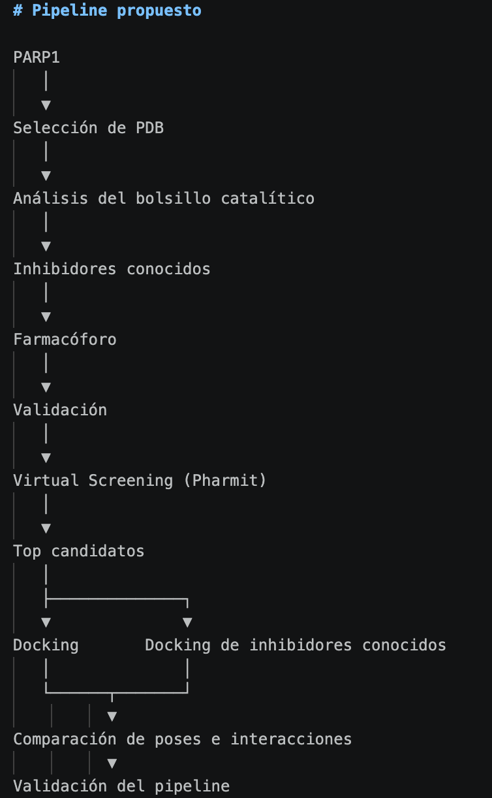
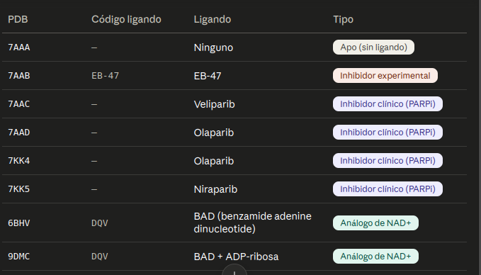

# TFM - Desarrollo y validación de un pipeline computacional para la identificación de inhibidores de PARP1 a partir de datos públicos

## Objetivo general

Este TFM no pretende descubrir un nuevo inhibidor de PARP1.

El objetivo es desarrollar un pipeline reproducible para cribado virtual y docking molecular que pueda reutilizarse en otras dianas farmacológicas, utilizando PARP1 como caso de estudio debido a la gran cantidad de información estructural y experimental disponible.

---

# Motivación

¿Por qué PARP1?

- Gran cantidad de estructuras cristalográficas disponibles.
- Numerosos ligandos con actividad experimental.
- Diana farmacológica ampliamente estudiada y de gran interes biológico.
- Excelente candidata para validar un pipeline computacional.

---

# Pregunta de investigación

¿Es posible desarrollar un pipeline reproducible capaz de recuperar y priorizar inhibidores conocidos de PARP1 utilizando únicamente información estructural y bases de datos públicas?

---

# Hipótesis

Un pipeline basado en análisis estructural, generación de farmacóforos, cribado virtual y docking molecular será capaz de recuperar inhibidores conocidos y priorizar nuevos candidatos compatibles con el sitio catalítico de PARP1.

---

# Pipeline propuesto

---

# Decisiones tomadas

## Diana

✔ PARP1

Motivos:

- muchas estructuras
- muchos artículos
- muchos inhibidores
- posibilidad de validación

---

## Datos

Proteína

- PDB
- AlphaFold

Ligandos

- ChEMBL
- PDB Ligand Expo

Compuestos

- ZINC
- ChEMBL

---

# Herramientas previstas

## Linux

Ubuntu

## Lenguaje

Python

## Librerías

- RDKit
- pandas
- numpy
- matplotlib

## Bioinformática estructural

- PyMOL
- PLIP
- Open Babel
- AutoDock Vina (o GNINA)
- Meeko

---

# Dudas abiertas

- ¿Una estructura o varias?

Tengo 9 estructuras:
    - Estructura de la proteína completa predicha con ALphaFold
    - 8 proteínas cristalizadas experimentalmente de la región catalítica (1 sin nada, 2 con análogos de NAD+ y 5 con inhibidores)

- ¿Validar docking mediante redocking?

Validación con las estructuras ya conocidas de los inhibidores ya cristalizados

- ¿Qué resolución mínima aceptar?
- ¿Qué scoring utilizar?
- ¿Cómo evaluar el farmacóforo?
- ¿Qué conjunto de compuestos usar para el screening?

ZINC20 / PUBCHEM ...

---

# Próximas tareas

- [ ] Revisar si existe algún tipo de farmacóforo ya modelado
- [ ] Crear tabla comparativa de PDB.
- [ ] Descargar ligandos desde ChEMBL.
- [ ] Diseñar la validación del pipeline.

---

# Ideas futuras

- Automatizar completamente el pipeline.
- Añadir contenedor Docker.

## Pruebas de herramientas

### OpenPharmacophore

Fecha:
01/07/2026

Instalación:

pip install openpharmacophore

Resultado:
No disponible en PyPI.

Acción:
Instalación desde repositorio GitHub.  (pip install git+https://github.com/UnixJunkie/OpenPharmacophore.git)